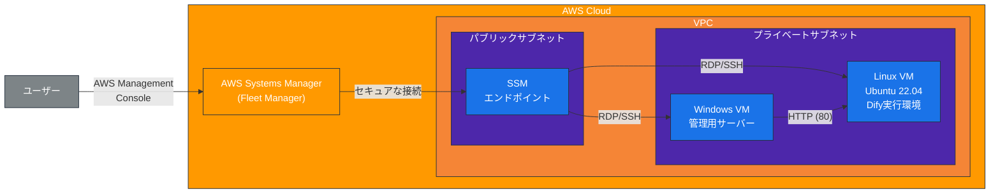
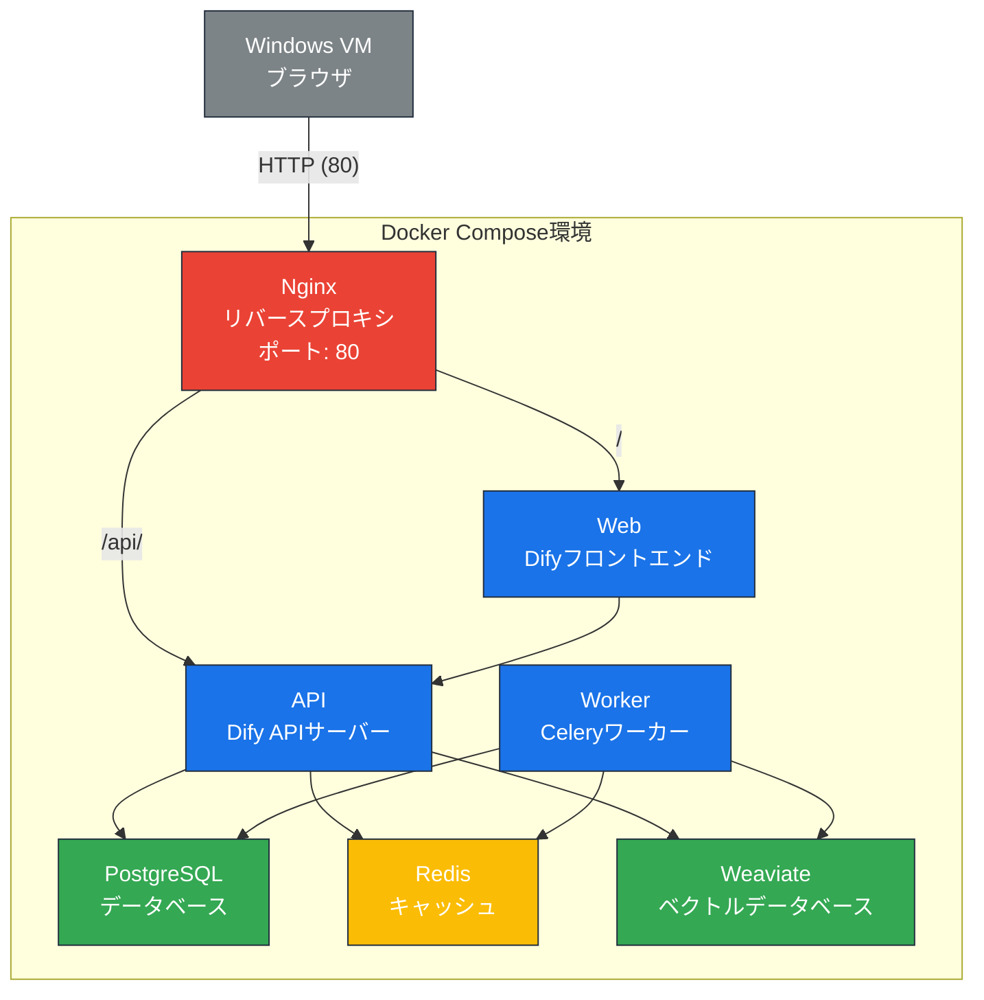

# AWS CDK Dify デプロイメントプロジェクト

このプロジェクトは、AWS CDKを使用してDifyアプリケーションを実行するためのインフラストラクチャをデプロイします。

## アーキテクチャ



## 構成

- Windows Server: 管理用、Linux Serverを管理するサーバ。ブラウザでDifyへアクセス。
- Linux Server: Ubuntu 22.04、Difyが起動。Docker Composeを使用して複数のコンテナを実行。

### Difyコンテナ構成



## ディレクトリ構造

```
.
├── README.md                      # プロジェクト説明
├── app.py                         # CDKアプリケーションのエントリーポイント
├── cdk.json                       # CDK設定ファイル
├── requirements.txt               # Pythonの依存関係
├── setup.py                       # セットアップスクリプト
├── source.bat                     # Windowsでの環境設定（CDK自動生成）
├── dify_cdk/                      # CDKスタック定義
│   ├── __init__.py
│   ├── dify_cdk_stack.py          # メインCDKスタック
│   ├── constructs/                # 再利用可能なコンストラクト
│   │   ├── __init__.py
│   │   ├── network.py             # ネットワーク関連のリソース
│   │   ├── security.py            # セキュリティグループなど
│   │   ├── windows_instance.py    # Windows VMの定義
│   │   └── linux_instance.py      # Linux VMの定義
│   └── config/                    # 設定ファイル
│       ├── __init__.py
│       └── config.py              # 環境設定
└── scripts/                       # ユーザーデータスクリプト
    ├── user_data_windows.ps1      # Windows VM初期化スクリプト
    └── user_data_ubuntu.sh        # Linux VM初期化スクリプト（Difyセットアップ含む）
```

## 前提条件

- Python 3.8以上
- AWS CDK v2
- AWS CLI（設定済み）
- AWS アカウントとアクセス権限

## セットアップ手順

1. 仮想環境を作成してアクティベート
```
python -m venv .venv
source .venv/bin/activate  # Linuxの場合
.venv\Scripts\activate     # Windowsの場合
```

2. 依存関係をインストール
```
pip install -r requirements.txt
```

3. CDKをデプロイ
```
cdk deploy
```

## 使用方法

1. デプロイ完了後、AWS Management Consoleにログイン
2. AWS Systems Manager > Fleet Managerを開く
3. デプロイされたインスタンスに接続
4. Linux VMでは、Difyが `/opt/dify/docker` ディレクトリにインストールされ、自動的に起動
5. Windows VMからブラウザを使用して、Linux VMのプライベートIPアドレスにアクセスしてDifyを利用

## VMパスワードの変更方法

### Windows VMのパスワード変更

Windows VMのAdministratorパスワードを変更するには、以下の手順で`scripts/user_data_windows.ps1`ファイルを編集します：

```powershell
# 管理者パスワードの設定
$Password = ConvertTo-SecureString '新しいパスワード' -AsPlainText -Force
$UserAccount = Get-LocalUser -Name 'Administrator'
$UserAccount | Set-LocalUser -Password $Password
```

`'新しいパスワード'`の部分を、希望するパスワードに変更してください。パスワードは複雑さの要件（大文字、小文字、数字、特殊文字を含む）を満たす必要があります。

### Linux VMのパスワード変更

Linux VMでは、初期設定で`ubuntu`ユーザーがデフォルトで使用されます。パスワードを設定するには、`scripts/user_data_ubuntu.sh`ファイルに以下の行を追加します：

```bash
# ubuntuユーザーのパスワード設定
echo 'ubuntu:新しいパスワード' | chpasswd
```

この行を`# ubuntuユーザーをdockerグループに追加`の行の後に追加することをお勧めします。

## 注意事項

- このインフラストラクチャは、インターネットからの直接アクセスを許可していません
- Difyへのアクセスは、VPC内のリソースからのみ可能です
- 複数環境のデプロイには、`cdk.context.json`ファイルでスタック名やタグを変更してください
- パスワードはソースコードに平文で保存されるため、本番環境では適切なシークレット管理を検討してください
