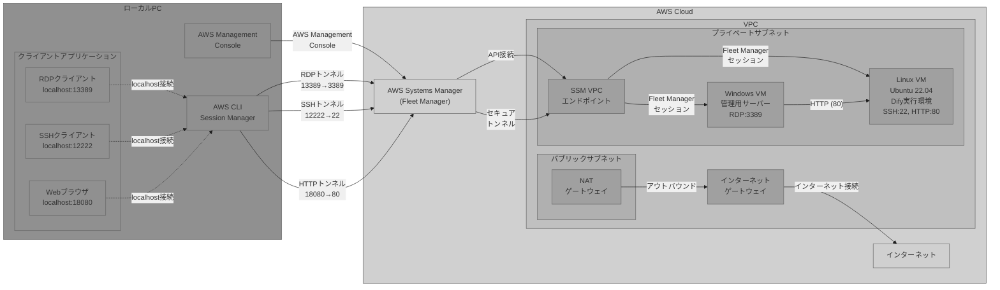
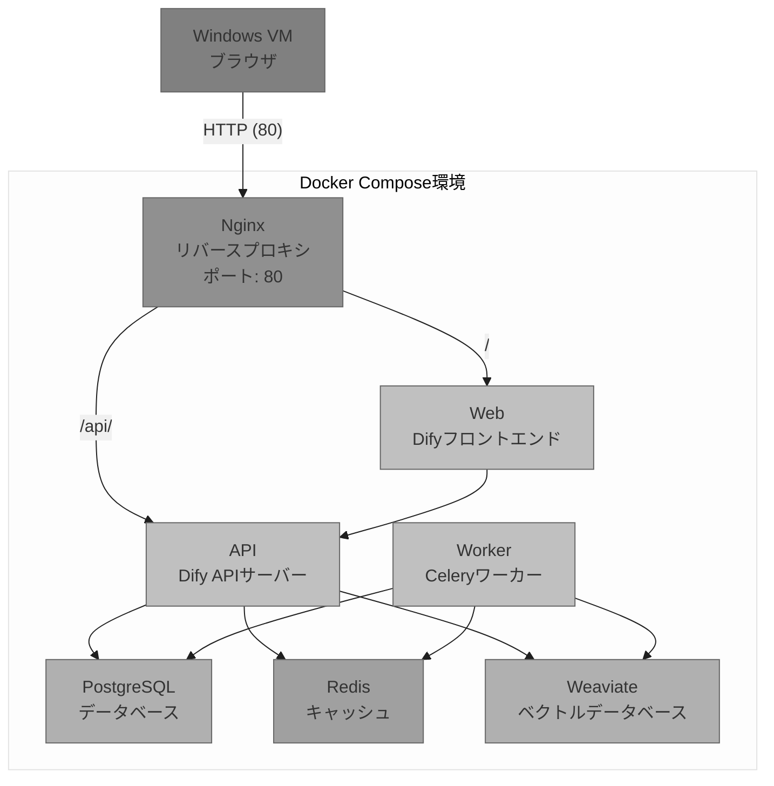

# AWS CDK Dify デプロイメントプロジェクト

このプロジェクトは、AWS CDKを使用してDifyアプリケーションを実行するためのインフラストラクチャをデプロイします。

## 概要

このプロジェクトでは、以下の構成でDifyアプリケーションをAWS上にデプロイします：

- **Windows Server**: 管理用サーバー（日本語版Windows Server 2022）
- **Linux Server**: Dify実行環境（Ubuntu 22.04、Docker Compose使用）
- **セキュアアクセス**: AWS Systems Manager Fleet Managerを使用したVPC内接続

詳細なアーキテクチャ図については、[付録](#付録)をご参照ください。


## 前提条件

- Python 3.8以上
- AWS CDK v2
- AWS CLI（設定済み）
- AWS アカウントとアクセス権限

## セットアップ手順

1. 仮想環境を作成してアクティベート
```
python -m venv .venv
source .venv/bin/activate  # Linuxの場合
.venv\Scripts\activate     # Windowsの場合
```

2. 依存関係をインストール
```
pip install -r requirements.txt
```

3. 環境変数の設定（**必須**）

   セキュリティのため、VMのログイン認証情報は環境変数で設定する必要があります：

   ```bash
   # テンプレートファイルをコピー
   cp .env.example .env
   ```

   `.env`ファイルを編集して、**必ず実際の値を設定してください**：

   ```bash
   # VM認証情報（必須）
   WINDOWS_ADMIN_USERNAME=Administrator
   WINDOWS_ADMIN_PASSWORD=YOUR_SECURE_WINDOWS_PASSWORD  # 必ず変更してください
   LINUX_ADMIN_USERNAME=ubuntu
   LINUX_ADMIN_PASSWORD=YOUR_SECURE_LINUX_PASSWORD     # 必ず変更してください

   # プロジェクト設定
   APP_NAME=dify
   ENV_NAME=dev

   # インフラストラクチャ設定（オプション）
   VPC_CIDR=10.0.0.0/16
   WINDOWS_INSTANCE_TYPE=t3.medium
   LINUX_INSTANCE_TYPE=t3.large
   ```

   **⚠️ セキュリティ注意事項**:
   - パスワードは必ず強固なものに変更してください
   - `.env`ファイルは機密情報を含むため、Gitリポジトリにコミットされません
   - `.env`ファイルのファイル権限を適切に設定してください（`chmod 600 .env`）

   **システム環境変数の使用**

   `.env`ファイルの代わりに、システムの環境変数を直接設定することも可能です：

   ```bash
   export WINDOWS_ADMIN_USERNAME="Administrator"
   export WINDOWS_ADMIN_PASSWORD="YourWindowsPassword"
   export LINUX_ADMIN_USERNAME="ubuntu"
   export LINUX_ADMIN_PASSWORD="YourLinuxPassword"
   ```

4. （オプション）AWS認証情報を設定
   通常はAWS CLIで認証情報が設定されていますが、一時的な認証情報や異なるプロファイルを使用する場合は、以下の環境変数を設定できます：

```bash
export AWS_ACCESS_KEY_ID="<アクセスキーID>"
export AWS_SECRET_ACCESS_KEY="<シークレットアクセスキー>"
export AWS_SESSION_TOKEN="<セッショントークン>"
```

   **注意:** 上記はプレースホルダーです。実際の認証情報は以下の方法で取得してください：
   - AWS IAM Identity Center (SSO)
   - AWS STS (Security Token Service)
   - IAMユーザーのアクセスキー

5. （オプション）AWS リージョンを設定
```
export AWS_DEFAULT_REGION=ap-northeast-1
```

6. CDKをデプロイ
```
cdk deploy
```

## 使用方法

1. デプロイ完了後、AWS Management Consoleにログイン
2. AWS Systems Manager > Fleet Managerを開く
3. デプロイされたインスタンスに接続
4. Linux VMでは、Difyが `/opt/dify/docker` ディレクトリにインストールされ、自動的に起動
5. Windows VMからブラウザを使用して、Linux VMのプライベートIPアドレスにアクセスしてDifyを利用

## VMパスワードの変更方法

### 設定ファイルでの変更（推奨）

VMのパスワードを変更する最も簡単な方法は、`.env`ファイルを更新することです：

1. `.env`ファイルを編集してパスワードを変更
2. CDKスタックを再デプロイ：`cdk deploy`

### 環境変数での変更

デプロイ時に環境変数を使用してパスワードを上書きできます：

```bash
export WINDOWS_ADMIN_PASSWORD="新しいWindowsパスワード"
export LINUX_ADMIN_PASSWORD="新しいLinuxパスワード"
cdk deploy
```

### Windows VMでの直接変更

Systems Manager Session Managerを使用してWindows VMに接続し、PowerShellで以下のコマンドを実行：

```powershell
# 管理者パスワードの設定
$Password = ConvertTo-SecureString '新しいパスワード' -AsPlainText -Force
$UserAccount = Get-LocalUser -Name 'Administrator'
$UserAccount | Set-LocalUser -Password $Password
```

### Linux VMでの直接変更

Systems Manager Session Managerを使用してLinux VMに接続し、以下のコマンドを実行：

```bash
# ubuntuユーザーのパスワード設定
sudo passwd ubuntu
```

## 注意事項

- このインフラストラクチャは、インターネットからの直接アクセスを許可していません
- Difyへのアクセスは、VPC内のリソースからのみ可能です
- 複数環境のデプロイには、`cdk.context.json`ファイルでスタック名やタグを変更してください
- パスワードは`.env`ファイルに平文で保存されるため、本番環境では適切なシークレット管理（AWS Secrets Manager等）を検討してください
- `.env`ファイルは機密情報を含むため、適切なファイル権限を設定し、バージョン管理システムにコミットしないでください

## 付録

### AWSアーキテクチャ図



### Difyコンテナ構成図




### ローカルPCからのポートフォワード接続

AWS Systems Manager Session Managerを使用して、ローカルPCからVMインスタンスへポートフォワード接続を行うことができます。

#### 前提条件

- AWS CLI v2がインストールされていること
- Session Manager pluginがインストールされていること
- 適切なAWS認証情報が設定されていること

#### RDP接続（Windows VM）

1. ポートフォワードセッションを開始：
```bash
aws ssm start-session --target <Windows-インスタンスID> --document-name AWS-StartPortForwardingSession --parameters "portNumber=3389,localPortNumber=13389"
```

2. 別のターミナルまたはコマンドプロンプトで、リモートデスクトップクライアントを使用して接続：
```
mstsc /v:localhost:13389
```

または、リモートデスクトップクライアントで `localhost:13389` に接続

#### SSH接続（Linux VM）

1. ポートフォワードセッションを開始：
```bash
aws ssm start-session --target <Linux-インスタンスID> --document-name AWS-StartPortForwardingSession --parameters "portNumber=22,localPortNumber=12222"
```

2. 別のターミナルでSSH接続：
```bash
ssh -p 12222 ubuntu@localhost
```

#### HTTPS接続（Dify Webインターフェース）

Linux VMで実行中のDifyに直接アクセスする場合：

1. ポートフォワードセッションを開始：
```bash
aws ssm start-session --target <Linux-インスタンスID> --document-name AWS-StartPortForwardingSession --parameters "portNumber=80,localPortNumber=18080"
```

2. ブラウザで以下のURLにアクセス：
```
http://localhost:18080
```

#### インスタンスIDの確認方法

1. AWS Management Consoleにログイン
2. EC2サービスを選択
3. 「インスタンス」ページで、対象のWindows VMまたはLinux VMを確認
4. インスタンスIDをコピー（例：`i-0123456789abcdef0`）

#### 注意事項

- `<Windows-インスタンスID>`、`<Linux-インスタンスID>` は実際のインスタンスIDに置き換えてください
- ポートフォワードセッションは、コマンドを実行しているターミナルを開いている間のみ有効です
- セッションを終了するには、`Ctrl+C` を押してください
- ローカルポート番号は任意の使用可能なポート番号に変更できます
- 複数のセッションを同時に実行する場合は、異なるローカルポート番号を使用してください

### ディレクトリ構造

```
.
├── README.md                      # プロジェクト説明
├── app.py                         # CDKアプリケーションのエントリーポイント
├── cdk.context.json               # CDKコンテキスト設定
├── cdk.json                       # CDK設定ファイル
├── LICENSE                        # ライセンスファイル
├── requirements.txt               # Pythonの依存関係
├── setup.py                       # セットアップスクリプト
├── source.bat                     # Windowsでの環境設定（CDK自動生成）
├── dify_cdk/                      # CDKスタック定義
│   ├── __init__.py
│   ├── dify_cdk_stack.py          # メインCDKスタック
│   ├── config/                    # 設定ファイル
│   │   ├── __init__.py
│   │   └── config.py              # 環境設定
│   └── constructs/                # 再利用可能なコンストラクト
│       ├── __init__.py
│       ├── linux_instance.py     # Linux VMの定義
│       ├── network.py             # ネットワーク関連のリソース
│       ├── security.py            # セキュリティグループなど
│       └── windows_instance.py   # Windows VMの定義
└── images/                        # アーキテクチャ図ファイル
    ├── gen1.drawio               # 第1世代アーキテクチャ図
    └── gen2.drawio               # 第2世代アーキテクチャ図
```
